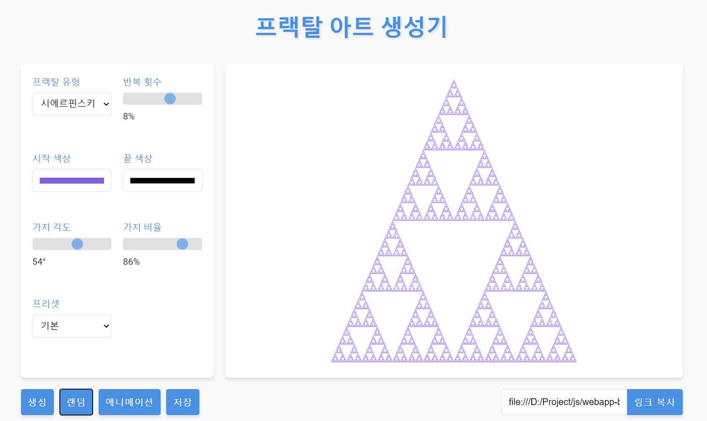

# 프랙탈 아트 생성기 웹 앱
- [claude 3.5 sonnet](https://www.anthropic.com/news/claude-3-5-sonnet)를 사용하여 생성됨.

-------
### 기능
- 프랙탈 유형 선택
- 반복 횟수 선택
- 시작 색상 선택
- 끝 색상 선택
- 가지 각도 조절
- 가지 비율 조절
- 프리셋 설정
- 랜덤 선택
- 애니메이션 보기
- 이미지로 저장
- 공유