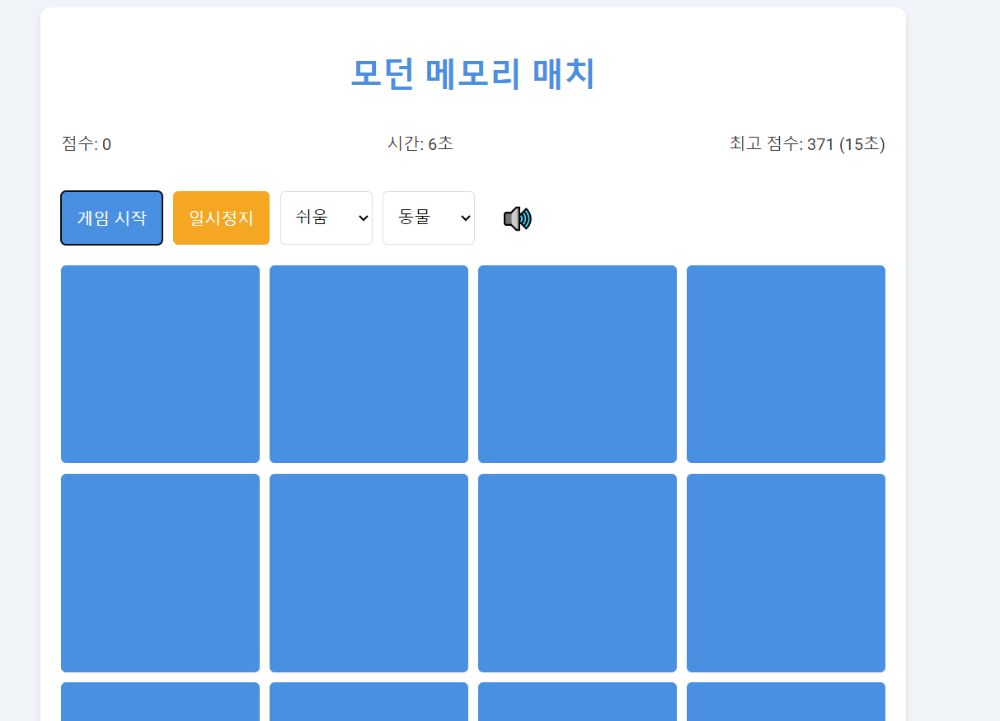

# 메모리 매치 카드 게임 웹 앱
- [claude 3.5 sonnet](https://www.anthropic.com/news/claude-3-5-sonnet)를 사용하여 생성됨.

-------
### 기능
- 게임 플레이:
    - 카드 뒤집기 및 매칭
    - 점수 시스템
    - 타이머 기능
- 난이도 설정:
    - 쉬움 (16장 - 8쌍)
    - 보통 (24장 - 12쌍)
    - 어려움 (36장 - 18쌍)
- 테마 선택:
    - 동물
    - 과일
    - 이모지
- 사운드:
    - Web Audio API를 사용한 배경 음악
    - 카드 뒤집기 및 매칭 효과음
    - 음소거 토글 기능
- 게임 컨트롤:
    - 시작 버튼
    - 일시정지/재개 버튼
- 점수 관리:
    - 현재 점수 표시
    - 최고 점수 저장 및 표시 (로컬 스토리지 사용)
- 반응형 디자인:
    - 다양한 화면 크기에 대응하는 레이아웃
- 튜토리얼:
    - 첫 방문 시 게임 방법 안내
    - 로컬 스토리지를 사용하여 튜토리얼 표시 여부 관리
- 게임 종료:
    - 모든 카드 매칭 시 게임 종료
    - 최종 점수 및 소요 시간 표시
- 카드 레이아웃:
    - 난이도에 따라 동적으로 조정되는 그리드 레이아웃
- 애니메이션:
    - 카드 뒤집기 애니메이션