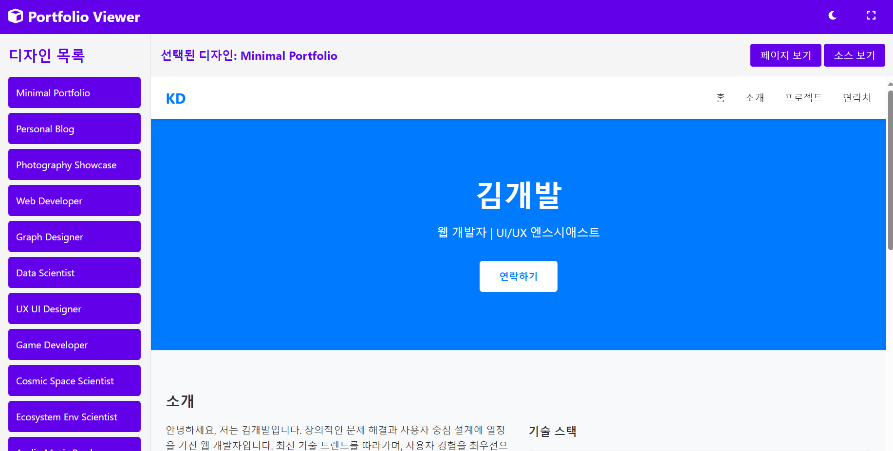

# 포트폴리오 디자인 템플릿 게시 웹 앱
- [claude 3.5 sonnet](https://www.anthropic.com/news/claude-3-5-sonnet)와 [claude 3.7 sonnet](https://www.anthropic.com/news/claude-3-7-sonnet)를 사용하여 생성됨.
- 이미지는 [뤼튼](https://wrtn.ai)를 사용

-------
### 기능
- claude 3.5과 claude 3.7가 제작한 템플릿(designs 폴더)
- 뤼튼이 제작한 이미지(images 폴더)