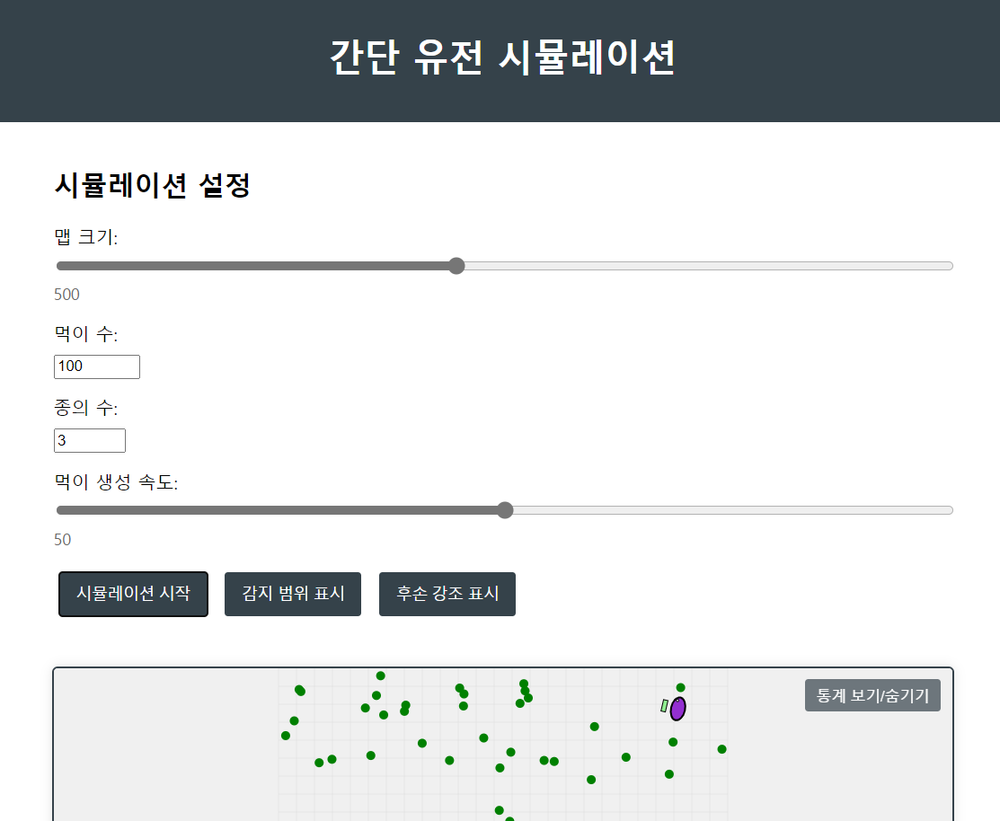

# 간단한 시뮬레이션 웹 앱
- [claude 3.5 sonnet](https://www.anthropic.com/news/claude-3-5-sonnet)를 사용하여 생성됨.

-------
### 기능
- 초기 맵 크기 설정(시뮬레이션 재시작 필요)
- 최대 먹이 수 설정(시뮬레이션 재시작 필요)
- 최대 종의 수 설정(시뮬레이션 재시작 필요)
- 먹이 생성 속도 설정(시뮬레이션 재시작 필요)
- 시뮬레이션 시작(재시작)
- 유기체의 감지 범위 표시
- 후손 강조 표시(최초 조상의 후손들을 강조 표시)
- 통계 보기
- 유기체 클릭 시(할 수 있다면...) 유기체 정보 표시
