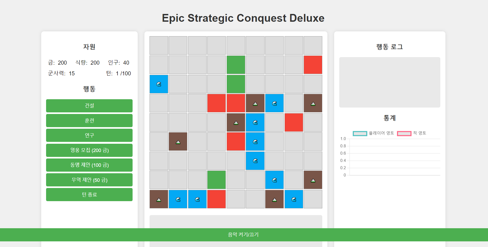

# Epic Strategic Conquest Deluxe 웹 게임
- [Claude 3.5 Sonnet](https://www.anthropic.com/news/claude-3-5-sonnet)를 사용하여 개발됨.

-------
### 주요 기능
- 턴제 기반의 전략 게임
- 자원 관리 및 영토 확장
- AI 적과의 대결
- 기술 연구 및 유닛 훈련
- 동적 이벤트 시스템

### 게임플레이 요소
- 다양한 지형(평지, 산, 물)
- 건물 건설: 농장, 광산, 훈련소, 방어탑
- 유닛 훈련: 일꾼, 보병, 궁수, 기병
- 외교 시스템: 동맹 및 무역 협정
- 영웅 시스템

### 기술 스택
- HTML5, CSS3, Vanilla JavaScript
- 반응형 디자인으로 데스크톱 및 모바일 지원
- Web Audio API를 이용한 사운드 시스템
- Chart.js를 활용한 게임 통계 시각화