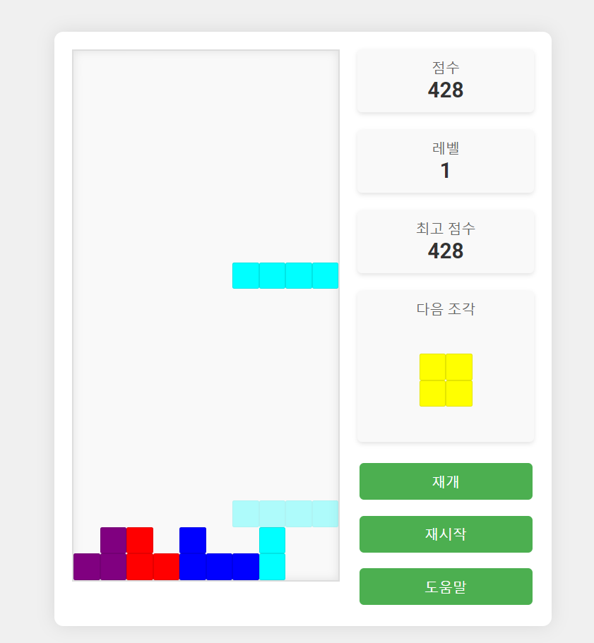

# 테트리스 웹 앱
- [claude 3.5 sonnet](https://www.anthropic.com/news/claude-3-5-sonnet)를 사용하여 생성됨.

-------
### 기능
- 고스트 피스: 현재 조각이 떨어질 위치를 미리 보여주는 반투명한 조각
- 점진적 난이도 증가: 시간이 지남에 따라 게임 속도가 점점 빨라짐
- 효과음: 조각 이동, 회전, 드롭, 라인 제거 시 소리 재생
- 점수 시스템: 라인 제거 및 게임 시간에 따른 점수 부여
- 하이스코어 저장 및 표시
- 일시정지 및 재시작 기능
- 도움말